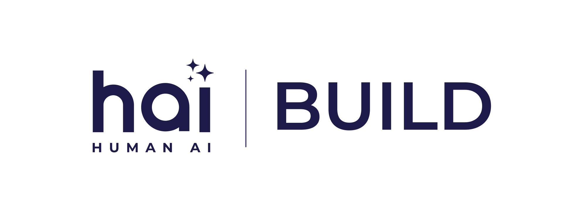
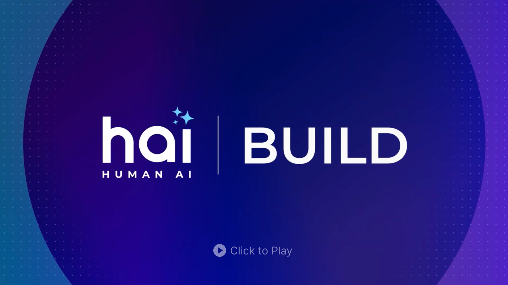
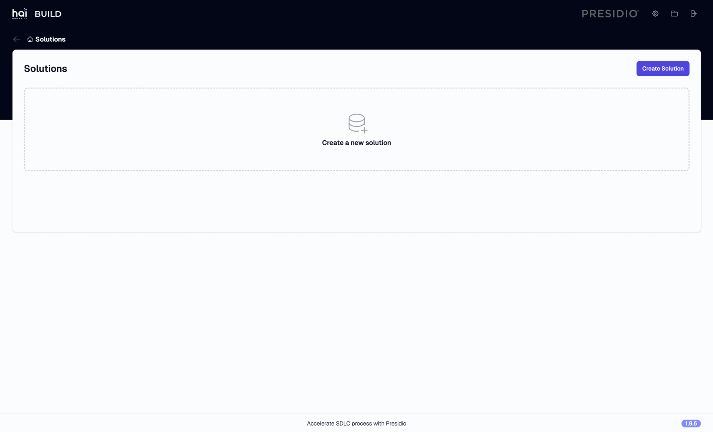
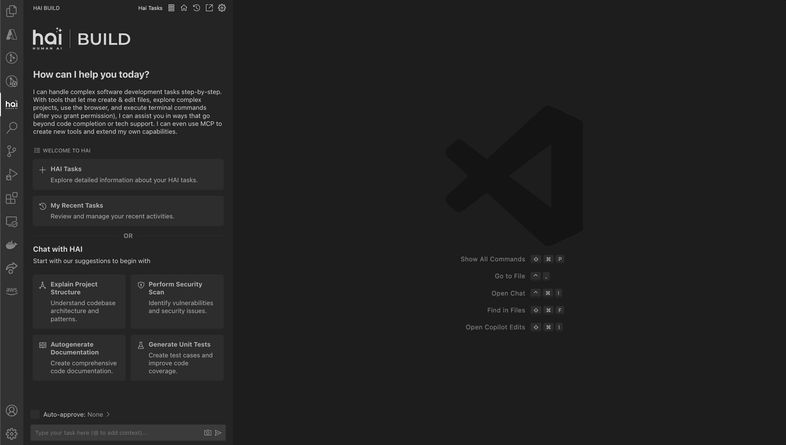

 

  <picture>
    <source media="(prefers-color-scheme: dark)" srcset="assets/img/hai-build-logo-light.png">
    <source media="(prefers-color-scheme: light)" srcset="assets/img/hai-build-logo-theme.png">
    
  </picture>

   

  <em>Accelerate your SDLC process with AI-powered intelligence.</em>

 

Over the years, the software development lifecycle has gotten inherently complex. As variables increase and new capabilities are rolled out that require niche skills, the complexity overwhelms. HAI is Presidio's human-centric approach to harnessing AI to help people work faster, better, and smarter. Our innovation unlocks the ideal working relationship between human and AI.

Our integrated product suite — Specifai, Code Generator, and Factif AI, is specifically crafted to meet these demands by seamlessly blending automation, intelligence, and quality assurance. From automating code generation and managing comprehensive requirements to ensuring rigorous testing, these tools streamline workflows and reduce manual intervention, enabling development teams to focus on delivering exceptional solutions.

# 🚀 Specifai

HAI Build's Specifai transforms the way teams generate, manage, and refine software requirements by blending AI-powered intelligence with human context. By simply providing the basic idea of the product you wish to build with tech stack details HAI Build automatically produces comprehensive requirement documentation.

> 🔗 View on GitHub: https://github.com/presidio-oss/specif-ai

## Key Features

* 🤖 **AI-Powered Document Generation**: Effortlessly create detailed SDLC documentation
* 💭 **Intelligent Chat Interface**: Get real-time requirement edits and context-specific suggestions
* 📊 **Business Process Visualization**: Easily generate and manage process flows
* 📝 **User Story Generation**: Convert requirements into actionable user stories and tasks
* 💬 **Real-time Collaboration**: Collaborate and refine requirements with team members
* 🖥️ **Desktop Integration**: Seamlessly integrate with your existing workflow tools
* 💬 **Multi-Modal Support**: Choose the model that best suits your needs. Supported models include:

### Supported Models

* Azure OpenAI
  * gpt-4o
  * gpt-4o-mini
* OpenAI Native
  * gpt-4o
  * gpt-4o-mini
* AWS Bedrock
  * anthropic.claude-3-5-sonnet-20240620-v1:0

 

# 🚀 Code Generator

HAI Build's Code Generator is designed to boost productivity and precision by automating task execution and integrating file management capabilities. It combines intelligent file indexing, context generation, and LLM-driven automation to minimize manual effort and ensure task accuracy. With user-friendly interfaces and configurable settings, HAI Code Generator is perfect for both developers and teams aiming to enhance their workflows.

> 🔗 View on GitHub (Cline based): https://github.com/presidio-oss/cline-based-code-generator

> 🔗 View on GitHub (Aider based): https://github.com/presidio-oss/aider-based-code-generator (**Archived**)

## Key Features

* 📁 **Code Indexing**: Index files with Faiss DB
* 💭 **Code Context**: Auto-generate code comments
* 🤖 **HAI Tasks**: Executes defined tasks via Requirement AI
* 📱 **User Stories Interface**: Accordion view of user stories
* 🔍 **Detailed User Story View**: In-depth user story information
* ✂️ **Detailed Task View**: View and execute tasks
* 🔎 **Fuzzy Search**: Quick search across tasks
* ⚙️ **Settings Interface**: Configure LLM, models, and preferences

 

# 🚀 Factifai

**Factifai** revolutionizes test automation by directly controlling your computer through AI. Using built-in vision capabilities of Claude, OpenAI, and Gemini along with computer use, it can navigate any application naturally - clicking, typing, and verifying results just like a human would.

> 🔗 View on GitHub: https://github.com/presidio-oss/factif-ai

## Key Features

* 🔮 **Multi-Modal Support**: Built-in support for leading vision-language models including Claude, OpenAI, Gemini, and OmniParser
* 🤖 **AI-Powered Computer Control**: Intelligent element detection, navigation, and automated verification
* 📸 **Automated Documentation**: Comprehensive test documentation with automated screenshot capture
* 🌐 **Flexible Testing Modes**: Support for both web applications (Puppeteer) and desktop/mobile applications (Docker VNC)

 

# 🎯 Why HAI Build?

By combining these three powerful tools, your team can:

* Accelerate software delivery with confidence
* Improve collaboration and alignment between teams
* Deliver high-quality solutions with reduced manual effort

This suite of tools is designed to meet the demands of today's fast-paced development environments, delivering precision, speed, and quality with every use. Whether you're generating code, building requirements, or executing regression test suits, our tools are here to help you succeed. Take your software development lifecycle to the next level with Specifai, Code generator  and Factifai testing suite.

## 📧 Contact

For any questions or feedback, please contact us at [hai-feedback@presidio.com](mailto:hai-feedback@presidio.com).
