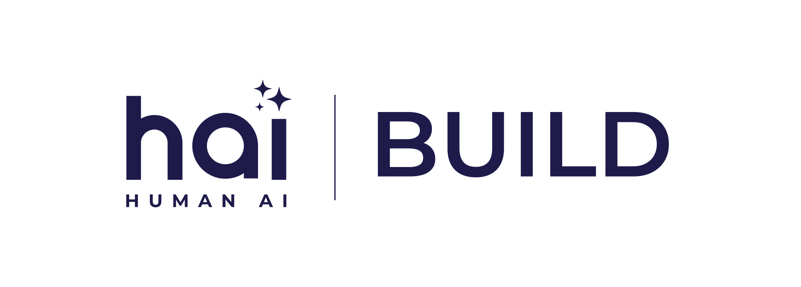

# 🎬 HAI Build Demos

  <picture>
    <source media="(prefers-color-scheme: dark)" srcset="assets/img/hai-build-logo-light.png">
    <source media="(prefers-color-scheme: light)" srcset="assets/img/hai-build-logo-theme.png">
    
  </picture>

   

  <em>This page showcases HAI Build's capabilities and integrations, highlighting how HAI accelerates the software development lifecycle through AI-powered tools and integrations.</em>

## 📋 Available Demos

| Demo | Description | Video |
|------|-------------|-------|
| 🤝 HAI x Amazon Q Developer | This demo showcases the seamless integration between HAI and [Amazon Q Developer](https://marketplace.visualstudio.com/items?itemName=AmazonWebServices.amazon-q-vscode) using MCP, enabling intelligent development workflows with contextual understanding. | [🎥 Watch Video](assets/demos/HAI%20x%20Amazon%20Q%20Developer.mp4) |

## 🎥 Video Previews

### 🤝 HAI x Amazon Q Developer
https://github.com/user-attachments/assets/e26dd2cb-61c9-4995-be8e-c52213c9336e

**Description:** This demo showcases how HAI Build and Amazon Q Developer work together through MCP integration to deliver an end-to-end AI-assisted development experience. [Learn more about Q Developer's MCP Integration](https://aws.amazon.com/blogs/devops/use-model-context-protocol-with-amazon-q-developer-for-context-aware-ide-workflows/).

### ✨ Here's what a smarter SDLC looks like:

- 📝 Use [Specifai](https://github.com/presidio-oss/specif-ai) to generate and refine requirements and instantly turn them into tasks
- 💻 Let [Amazon Q](https://marketplace.visualstudio.com/items?itemName=AmazonWebServices.amazon-q-vscode) convert those tasks into working code with the help of [Specifai MCP Server](https://github.com/presidio-oss/specifai-mcp-server)
- ✅ Track everything with [Jira](https://community.atlassian.com/forums/Atlassian-Platform-articles/Atlassian-Remote-MCP-Server-beta-now-available-for-desktop/ba-p/3022084) from your IDE!
- 📚 Document as you go in [Confluence](https://community.atlassian.com/forums/Atlassian-Platform-articles/Atlassian-Remote-MCP-Server-beta-now-available-for-desktop/ba-p/3022084) right from your IDE!
- 🧪 Use [Factifai](https://github.com/presidio-oss/factif-ai) to visually test and validate your implementation

  <h3>✨ More demos coming soon, stay tuned! ✨</h3>

